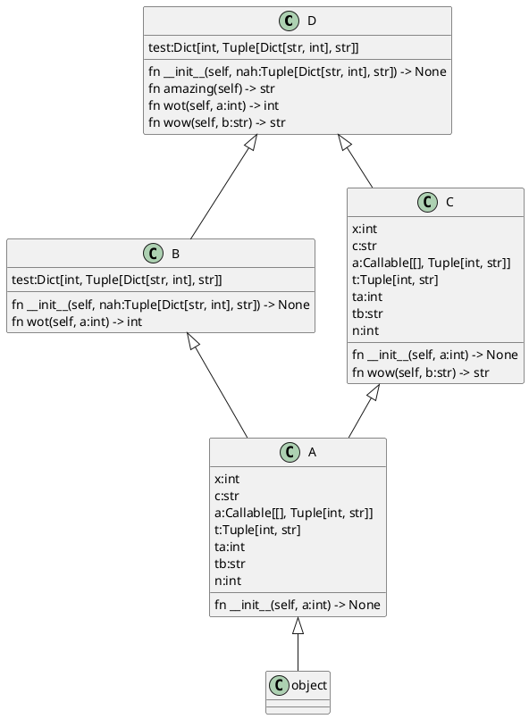

# Pyumlgen
A bad tool that generates plantuml UML for python source.

# Usage

```
$ pyumlgen example
```

# Example

```py
from typing import Dict, List, Tuple


def something(a: int, b: List[int]) -> str:
    return "blah"


def aaa() -> Tuple[int, str]:
    pass


class A:
    def __init__(self, a: int):
        self.x = a
        self.c = "hello"
        self.a = aaa
        self.t = aaa()
        self.ta, self.tb = aaa()
        self.n: int = somefunction_we_cant_see()


class B(A):
    def __init__(self, nah: Tuple[Dict[str, int], str]):
        self.test = {1: nah}

    def wot(self, a: int) -> int:
        pass


class C(A):
    def wow(self, b: str) -> str:
        pass


class D(B, C):
    def amazing(self) -> str:
        return self.c
```

emits the following:


